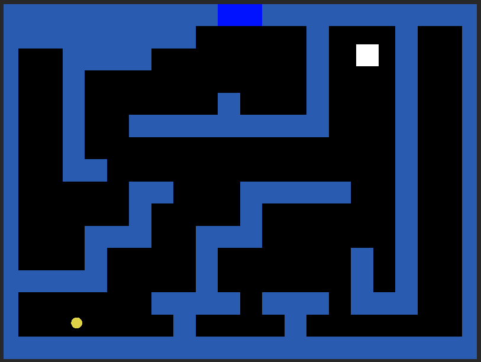

# 1 Hour Topdown

This is a Unity game I made as part of a challenge to practice game development. It was made within a timelimit of 1 hour, which explains its simplicity.

The idea is to get the key (yellow circle) to opens the door. The intention was to learn and explore concepts of Unity and what I can achieve in a limited time period with a finished project.

The game can be played on [Itch](https://lucas-bremm.itch.io/1-hour-topdown).